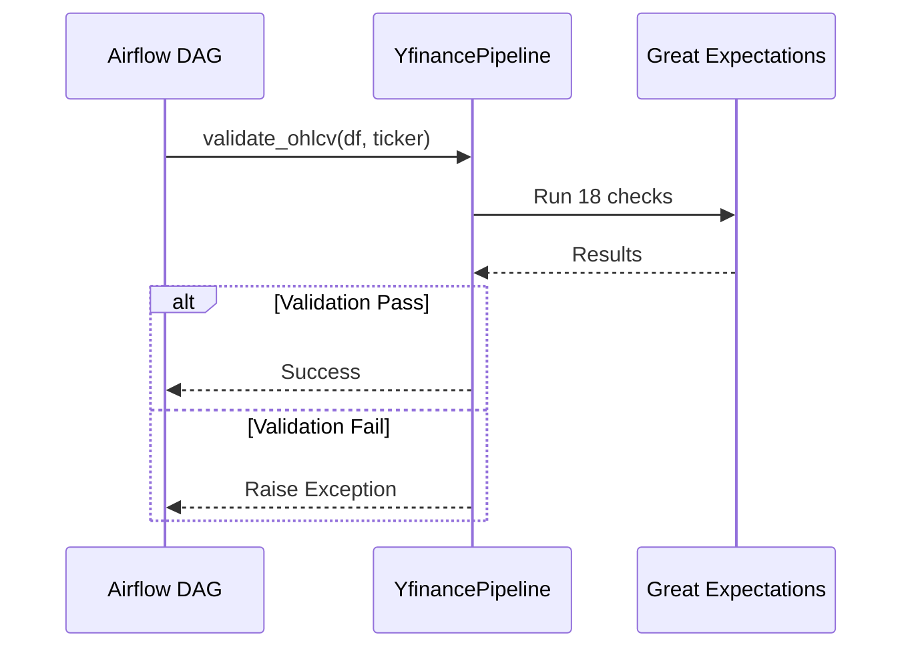

# Data Validation

Great Expectations validation framework for OHLCV data quality.

## Validation Process

## Validation Checks

!!! check "Schema Validation"
    - Required columns: Open, High, Low, Close, Volume

!!! check "Null Checks"
    - Zero tolerance for NaN/null values

!!! check "Price Logic"
    - High ≥ Low
    - Open/Close within High/Low range
    - Prices > $0.01

!!! check "Data Quality"
    - Standard deviation > 0.01 (detects constant values)
    - Minimum 10 rows
    - Unique dates (no duplicates)

!!! check "Volume"
    - Non-negative (0 allowed)

## Constants

Defined in `YfinancePipeline` class:

| Constant | Value | Purpose |
|----------|-------|---------|
| `TICKER_VALIDATION_TEST_DAYS` | 21 | Calendar days for ticker test |
| `MIN_TRADING_DAYS_FOR_VALIDATION` | 10 | Minimum trading days required |
| `MIN_OHLCV_ROWS_FOR_VALIDATION` | 10 | Minimum rows for validation |
| `MIN_PRICE_VALUE` | 0.01 | Minimum valid price |
| `MIN_STDDEV_VALUE` | 0.01 | Minimum standard deviation |
| `MAX_TICKER_LENGTH` | 5 | Maximum ticker symbol length |

## Error Handling

!!! warning "Validation Failures"
    Validation failures raise exceptions for Airflow to retry. Failed validations are logged with specific check names.

!!! tip "Debugging"
    Check Airflow task logs for detailed validation failure messages with check names and row counts.
