# Daily Parallel DAG

Automated daily updates for all registered securities. Runs weeknights after US market close to fetch the day's OHLCV and metadata.

## What It Does

Pulls all tickers from the database, downloads the latest trading day's data, validates it, and upserts to the hypertable. Handles weekends and holidays automatically - if you run it on Saturday, it gets Friday's data.

Good for keeping your database current with minimal overhead.

## Configuration

| Parameter | Value | Description |
|-----------|-------|-------------|
| `schedule` | `'30 21 * * 1-5'` | Weekdays 9:30 PM UTC (after US market close) |
| `trigger` | Automatic | Schedule-based |

## Task Flow

```mermaid
%%{init: {'theme':'base', 'themeVariables': { 'fontSize':'14px'}}}%%
graph LR
    A[get_tickers] --> B[download_ohlcv<br/>PARALLEL 20x]
    B --> C[validate_ohlcv<br/>PARALLEL 20x]
    C --> D[insert_ohlcv<br/>PARALLEL 20x]
    D --> E[download_metadata<br/>PARALLEL 20x]
    E --> F[insert_metadata<br/>PARALLEL 20x]
    F --> G[generate_report]

    style A fill:#f0f0f0,stroke:#333,color:#000
    style B fill:#e1f5ff,stroke:#333,color:#000
    style C fill:#e1f5ff,stroke:#333,color:#000
    style D fill:#e1f5ff,stroke:#333,color:#000
    style E fill:#e1f5ff,stroke:#333,color:#000
    style F fill:#e1f5ff,stroke:#333,color:#000
    style G fill:#d4edda,stroke:#333,color:#000
```

## Parallelization

- **Max concurrent**: 20 tasks at once (`max_active_tis_per_dag`)
- **Independence**: Each ticker processes separately
- **Failure handling**: Failed tickers don't block others (`trigger_rule: 'all_done'`)

## Retry Strategy

| Task | Retries | Delay | Why |
|------|---------|-------|-----|
| download_ohlcv | 3 | 2 min | yfinance rate limits |
| validate_ohlcv | 1 | 1 min | Validation rarely fails temporarily |
| insert_ohlcv | 3 | 1 min | DB under load |
| download_metadata | 3 | 2 min | Network issues |
| insert_metadata | 3 | 1 min | DB under load |

All use exponential backoff.
