# Historical Parallel DAG

Bulk historical data loader. Scrapes ticker lists, validates them, downloads multi-year OHLCV data, and stores everything in the database.

## What It Does

Gets ticker lists from public sources (Wikipedia, iShares, NASDAQ), validates each one by test-downloading recent data, then downloads the full historical range you specify. Everything runs in parallel - up to 20 tickers processing at once.

Good for initial database setup or backfilling new ticker lists.

## Configuration

| Parameter | Options | Default | Description |
|-----------|---------|---------|-------------|
| `years_back` | 1-10 | 10 | Years of historical data to download |
| `ticker_source` | sp500, russell3000, nasdaq, all | sp500 | Which ticker list to use |
| `ticker_limit` | 0-5000 | 0 | Limit tickers (0 = no limit) |

**Trigger**: Manual via Airflow UI

## Task Flow

```mermaid
%%{init: {'theme':'base', 'themeVariables': { 'fontSize':'14px'}}}%%
graph LR
    A[get_tickers] --> B[convert_to_list]
    B --> C[validate_ticker<br/>PARALLEL 20x]
    C --> D[filter_valid]
    D --> E[register_security<br/>PARALLEL 20x]
    E --> F[download_ohlcv<br/>PARALLEL 20x]
    F --> G[validate_ohlcv<br/>PARALLEL 20x]
    G --> H[insert_ohlcv<br/>PARALLEL 20x]
    H --> I[download_metadata<br/>PARALLEL 20x]
    I --> J[insert_metadata<br/>PARALLEL 20x]
    J --> K[generate_report]

    style A fill:#f0f0f0,stroke:#333,color:#000
    style B fill:#f0f0f0,stroke:#333,color:#000
    style C fill:#e1f5ff,stroke:#333,color:#000
    style D fill:#f0f0f0,stroke:#333,color:#000
    style E fill:#e1f5ff,stroke:#333,color:#000
    style F fill:#e1f5ff,stroke:#333,color:#000
    style G fill:#e1f5ff,stroke:#333,color:#000
    style H fill:#e1f5ff,stroke:#333,color:#000
    style I fill:#e1f5ff,stroke:#333,color:#000
    style J fill:#e1f5ff,stroke:#333,color:#000
    style K fill:#d4edda,stroke:#333,color:#000
```



## Parallelization

- **Max concurrent**: 20 tasks at once (`max_active_tis_per_dag`)
- **Independence**: Each ticker processes separately
- **Failure handling**: Failed tickers don't block others (`trigger_rule: 'all_done'`)

## Retry Strategy

| Task | Retries | Delay | Why |
|------|---------|-------|-----|
| validate_ticker | 2 | 1 min | Network flakiness |
| register_security | 2 | 1 min | DB connection issues |
| download_ohlcv | 3 | 2 min | yfinance rate limits |
| validate_ohlcv | 1 | 1 min | Validation rarely fails temporarily |
| insert_ohlcv | 3 | 1 min | DB under load |
| download_metadata | 3 | 2 min | Network issues |
| insert_metadata | 3 | 1 min | DB under load |

All use exponential backoff.

## Example Run

=== "Small Test"
    ```python
    # Parameters
    ticker_source = 'sp500'
    years_back = 1
    ticker_limit = 5
    
    # Result
    5 tickers × 1 year ≈ 2 minutes
    ```

=== "Full S&P 500"
    ```python
    # Parameters
    ticker_source = 'sp500'
    years_back = 10
    ticker_limit = 0
    
    # Result
    ~500 tickers × 10 years ≈ 2-3 hours
    ```

=== "Everything"
    ```python
    # Parameters
    ticker_source = 'all'
    years_back = 10
    ticker_limit = 0
    
    # Result
    ~6000 tickers × 10 years ≈ 12-18 hours
    ```
